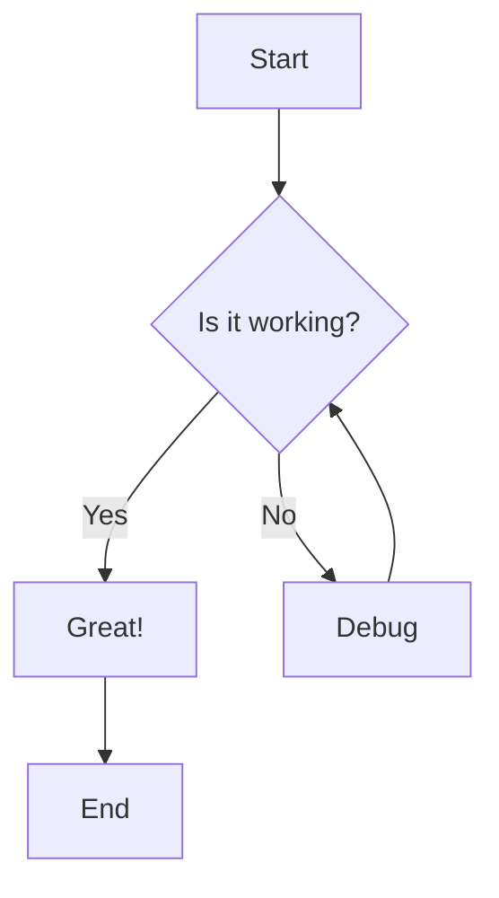

# Import Test

This is a test document to verify the bidirectional Confluence workflow.

## Table of Contents

## Introduction

This document tests the markdown-to-Confluence conversion process, including:

- Basic markdown formatting
- Table of Contents generation
- Mermaid diagram conversion

## Test Section

Here's some **bold text** and *italic text* to test basic formatting.

### Subsection

- Bullet point 1
- Bullet point 2
- Bullet point 3

1.  Numbered item 1
2.  Numbered item 2
3.  Numbered item 3

## Mermaid Diagram Test

This section contains a test Mermaid diagram:

### Figure 1: Test Flow Diagram

## Conclusion

If you can see this content properly formatted in Confluence with:

- ✅ Table of Contents macro
- ✅ Proper markdown formatting
- ✅ Mermaid diagram rendered correctly

Then the bidirectional workflow is working! 🎉
